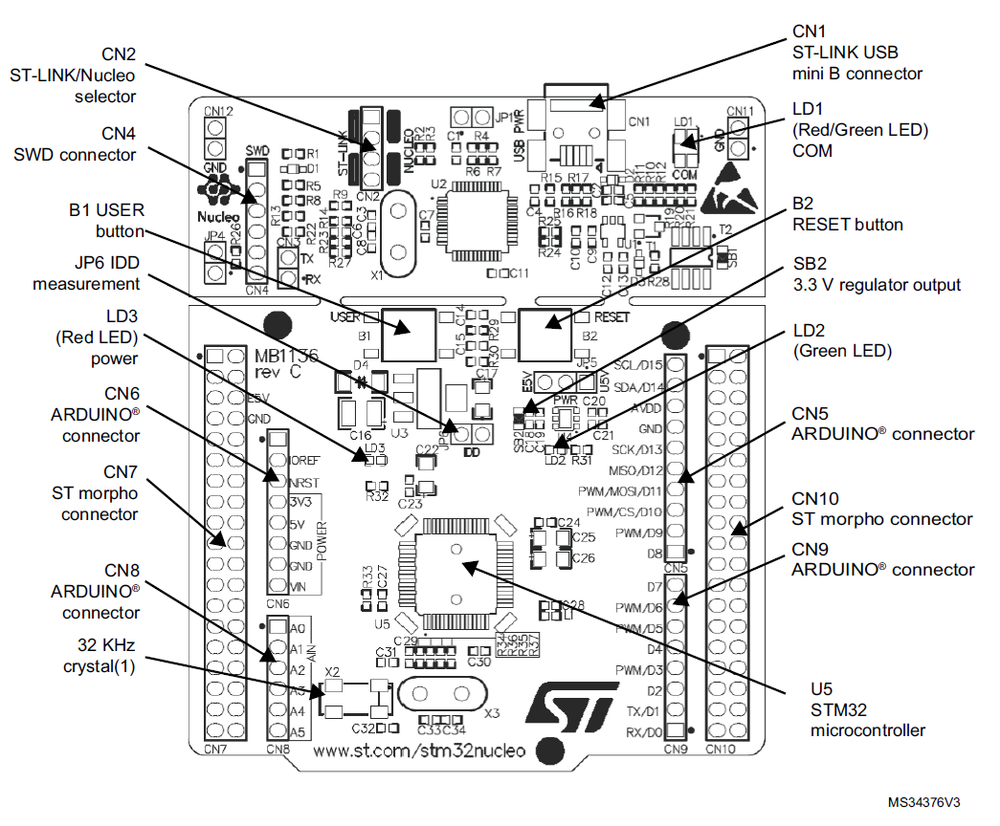
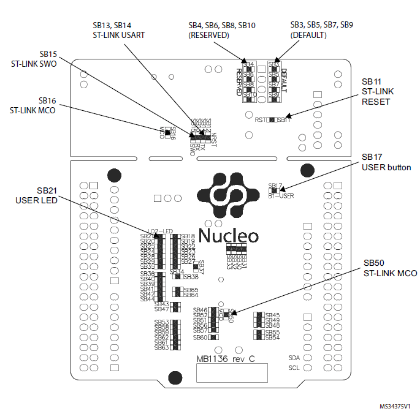
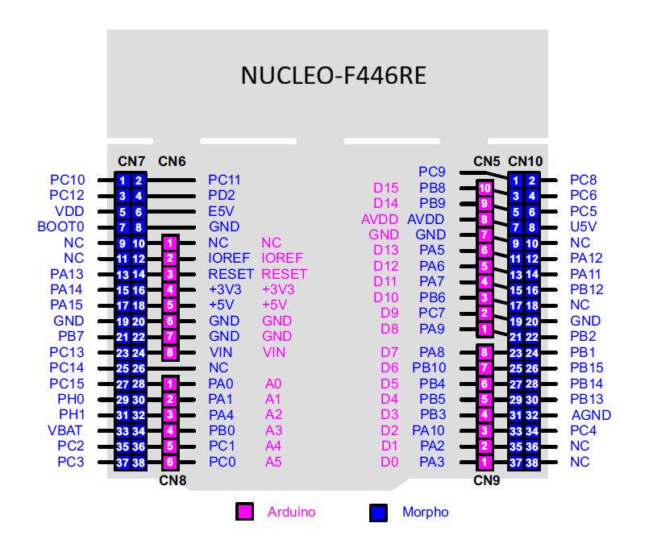

# STM32 Development Guide

A step-by-step guide for setting up STM32 projects using both **HAL (Hardware Abstraction Layer)** and **Bare-Metal (No HAL)** programming approaches with the **NUCLEO-F446RE** development board.

<p style="text-align: center;">
  
  
</p>

## 📋 Table of Contents

- [Prerequisites](#-prerequisites)
- [HAL Programming Workflow](#-hal-programming-workflow)
- [Bare-Metal Programming Workflow](#-bare-metal-programming-workflow)
- [Project Workspace Location](#-project-workspace-location)
- [Terminal Setup](#-terminal-setup)
- [Notes](#-notes)

## 🛠️ Prerequisites

Make sure the following tools are installed before getting started (version 2.1.0):

- **Software:**
  - [STM32CubeMX](https://www.st.com/en/development-tools/stm32cubemx.html)
  - [STM32CubeIDE](https://www.st.com/en/development-tools/stm32cubeide.html)
- **Terminal:**
  - [PuTTY](https://putty.org/index.html) (Windows)/ GTKterm (Linux)
  > 💡You can also use integrated Command Shell Console in STM32CubeIDE. See [Terminal Setup](#-terminal-setup) to configure the console.
- **Hardware:** NUCLEO-F446RE development board
- **Cable:** USB Type-A to Mini-B
- **Operating System:** Windows/ Linux

### Resources
- [Reference Manual](https://www.st.com/resource/en/reference_manual/rm0390-stm32f446xx-advanced-armbased-32bit-mcus-stmicroelectronics.pdf)
- [Datasheet](https://www.st.com/resource/en/datasheet/stm32f446mc.pdf)

## ⚙️ HAL Programming Workflow

HAL (Hardware Abstraction Layer) programming uses STM32CubeMX to auto-generate initialization code, which is then imported into STM32CubeIDE.

### Step 1 — Generate Code with STM32CubeMX

```
STM32CubeMX
  └── From New Project
        └── Start My Project from MCU
              └── ACCESS TO MCU SELECTOR
                    └── Commercial Part Number: STM32F446RET6TR
                          └── Start Project
                                └── Initialize all peripherals with default mode? → Yes
```

### Step 2 — Configure the Project Manager

```
Project Manager
  ├── Project Name     → LAB_1B <your-project-name>
  ├── Project Location → C:\Users\USER\STM32CubeIDE\workspace_2.1.0\ <your-project-location>
  └── Toolchain / IDE  → STM32CubeIDE
        └── GENERATE CODE
```

> **Prompts during generation:**
> | Prompt | Action |
> |---|---|
> | Project Manager Settings Popup | Click **Yes** |
> | Notification | Select **Don't ask me again** |
> | Licence Agreement | Click **Agree** → **Finish** |
> | Windows Security Alert | Click **Allow** |
> | Success Dialog | Click **Close** |

### Step 3 — Import Project into STM32CubeIDE

```
STM32CubeIDE
  └── File
        └── Open Projects from File System
              └── Import Source → Select project folder → Finish
```

## 🔩 Bare-Metal Programming Workflow

Bare-metal programming gives full control over hardware without abstraction layers. Projects are created directly in STM32CubeIDE.

### Step 1

```
STM32CubeIDE
  └── File
        └── STM32 Project Create/Import
              └── Create New STM32 Project
                    └── STM32CubeIDE Empty Project
                          └── Next
                                └── MCU/MPU Selector → STM32F446RETx
                                      └── Next
                                            └── Project Name → LAB_1A <your-project-name>
                                                  └── Finish
```

### Step 2

```
1. Copy 'Drivers' folder from HAL-based project that was created. <br>
2. Paste it into current project. <br>
3. Delete the 'STM32F4xx_HAL_Driver' from 'Drivers' folder. <br>
4. In 'Drivers -> CMSIS -> Include' and 'Drivers -> CMSIS -> Device -> ST -> STM32F4xx -> Include': Add/remove include path... -> OK

```
> ⚠️ Without the CMSIS driver, you cannot use predefined mnemonics. You must either define them yourself or use direct register values and addresses. 

## 📁 Project Workspace Location

By default, STM32CubeIDE projects are saved at:

```
C:\Users\USER\STM32CubeIDE\workspace_2.1.0\
```

> 💡 You can change this location during the IDE's initial workspace setup or via **File → Switch Workspace**.

## 🗖 Terminal Setup
We need a serial terminal to communicate with the computer via USART protocol. Follow these steps to configure the integrated serial terminal in **STM32CubeIDE**:

1. Go to 'open console', select **3 Command Shell Console**.
2. Put this:
   1. Connection Type: Serial Port
   2. Connection name → USART2 `<your-serial-port-name>` or New Serial Port Connection 
   3. Encoding: UTF-8
3. New serial port connection settings:
   1. Connection name: give it a name according to your preference
   2. Serial port: COM4 `<STLink-Virtual-COM-Port>`
   3. Baud rate: 115200
   4. Data size: 8
   5. Parity: None
   6. Stop bits: 1
   > ⚠️ Must match with your USART configuration of NUCLEO-F446RE device
4. How to find port number:
   1. Go to 'Device Manager'
   2. Find 'Ports (COM & LPT)' from the list
   3. Expand it, and you will see the port number <br>
      `STMicroelectronics STLink Virtual COM Port (COM4)`
   > ⚠️ Your NUCLEO-F446RE device must be connected with computer via cable 

## 📌 Notes

- Replace `<your-project-name>` and `<your-project-location>` with your actual project name and desired save path.
- The **HAL workflow** is recommended for beginners as it auto-generates peripheral configuration code.
- The **Bare-Metal workflow** is ideal for advanced users who want full hardware control.
- Arduino Uno pin diagram:

<p style="text-align: center;">
  
</p>

## 🌟 Show Your Support
If you found this guide helpful, please consider starring the repository to show your support. 
Your star would help increase the visibility and also encourage more learners to discover and benefit from it.

## 📄 License

This project is open-source under GPL-3.0 license. Feel free to use and modify it as needed. <br>
Image source: <a href="https://st.com">STMicroelectronics</a>
